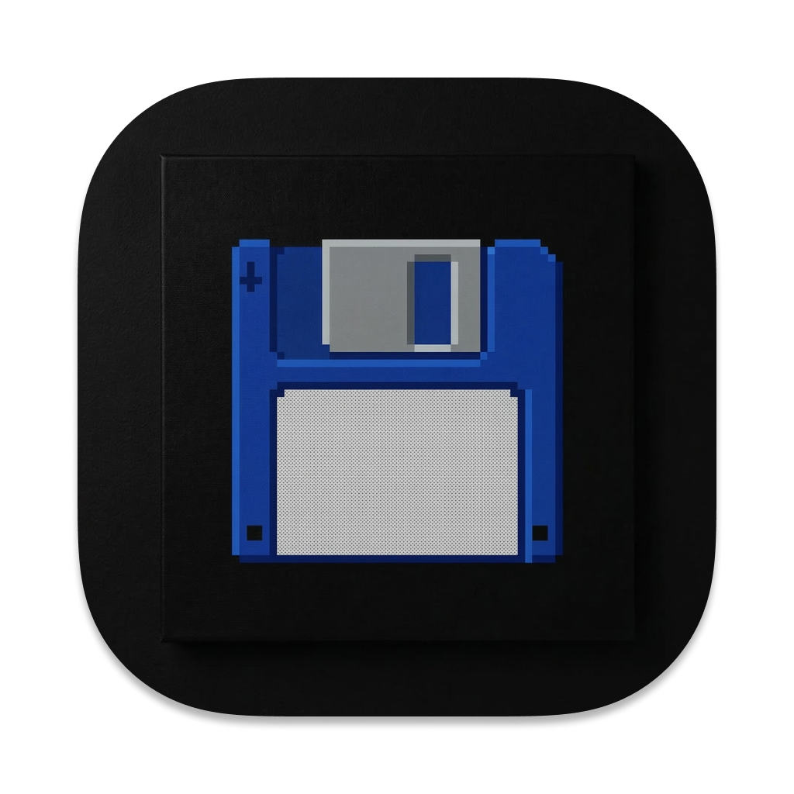

# Scratcher

[](CMakeLists.txt)
[](#supported-formats)
[](#supported-formats)
[](https://juce.com/)
[](CMakeLists.txt)
[](https://buymeacoffee.com/resonaura)

Dual-deck vinyl scratch emulator audio plugin and standalone instrument by **Resonaura**. Features realistic vinyl touch physics, high-order Hermite interpolation, dynamic crossfading, Gross Beat-inspired time manipulation envelopes, sample loading, and comprehensive MIDI Learn.


<p align="center">
  
</p>

---

## 🎧 Supported Formats

| Platform | Formats |
|----------|---------|
| macOS    | AU, VST3, Standalone |
| Windows  | VST3, Standalone |

---

## ✨ Key Features

- 🎛️ **Dual Vinyl Deck Architecture**: Two independent decks (Deck A & Deck B) with realistic touch-and-drag scratch physics, inertia decay, and reverse playback.
- 📐 **High-Order Hermite Interpolation**: 6-point, 5th-order polynomial interpolation for clean, artifact-free scrubbing and pitch modulation across all playback speeds.
- 🔀 **Constant-Power Crossfader**: Smooth blending between decks with configurable cut curves, sharp scratches, and MIDI mapping.
- 📈 **Gross Beat-Style Time & Volume Envelopes**: Integrated breakpoint curve editor for tempo-synced turntable slowdowns, drops, stutters, and scratching automation.
- 📂 **Flexible Sample Loading**: Drag-and-drop audio file loading into deck buffers with non-destructive trimming and auto-looping.
- 🎹 **Comprehensive MIDI Learn**: One-click MIDI CC binding for crossfader movements, deck speed, jog wheel scrubbing, and cue triggers.

---

## 🚀 Getting Started

### Prerequisites

| Tool | macOS | Windows |
|------|-------|---------|
| Git | ✅ | ✅ |
| CMake >= 3.22 | ✅ | ✅ |
| Ninja | ✅ (or Xcode) | Optional |
| Visual Studio 2022 | — | ✅ |
| Node.js | Optional (for npm build scripts) | Optional |

JUCE 8 is fetched automatically upon initial build or via `npm install`.

---

## 🛠️ Building & Installing

### With npm (recommended)

```bash
# Fetch dependencies & configure
npm install

# Build release plugins (auto-detects OS)
npm run build

# Build and install into system audio plug-in folders
npm run install:plugin
```

### Manual CMake Build

```bash
cmake -B build -DCMAKE_BUILD_TYPE=Release
cmake --build build --config Release
```

---

## 📦 Project Structure

```
scratcher/
├── src/
│   ├── PluginProcessor.h/.cpp     # Core audio DSP & host communication
│   ├── PluginEditor.h/.cpp        # Turntable GUI & interactive vinyl components
│   ├── DeckProcessor.h/.cpp       # Per-deck physical playback & scratch engine
│   ├── CircularBuffer.h           # Lock-free audio ring buffer
│   ├── HermiteInterp.h            # 6-point 5th-order polynomial interpolation
│   ├── CrossfaderMath.h           # Constant-power crossfade curves
│   ├── EnvelopeEditor.h/.cpp      # Breakpoint envelope visual editor
│   ├── MidiLearnManager.h/.cpp    # Dynamic MIDI CC routing & learn manager
│   └── SampleManager.h/.cpp       # Audio sample loading & buffer allocation
├── assets/                        # Vinyl labels, textures, CRT scanline overlays
├── fonts/                         # Custom pixel UI typefaces
├── samples/                       # Built-in demo scratch samples
├── scripts/                       # Cross-platform packaging & build scripts
└── CMakeLists.txt
```
